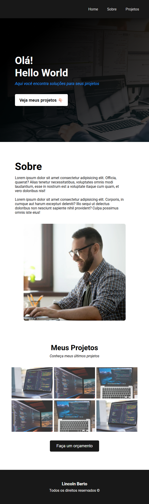

# 🦾 Portfólio Sujeito Programador

Esse projeto foi feito focado em praticar **HTML** e **CSS** de forma básica. E recemtemente eu fiz uma refatoração para poder deixa-lo responsivo.

# 🔗 Acesse o Projeto Online

Você pode acessar o projeto diretamente pelo link abaixo:
👉 [Clique aqui para ver o projeto online](https://portfolio-sujeito-programador-five.vercel.app/)

## 🛠️ Como o Projeto Foi Feito

O foco do projeto é o estudo de HTML e CSS, portanto foi feito uma estrutura básica com algumas tags semânticas e divisões.

## 🧠 Conceitos Trabalhados

-   **HTML5** semântico
-   **CSS3** básico com Media Queries
    -   Tipografia customizada
    -   Organização por componentes

## 📱 Funcionalidades

-   ✅ Navegação por menu usando ID control.
-   ✅ Temos um botão no header para navegação.

## 🔍 Preview do Projeto

### E também a visualização com a responsividade trabalhada.

---

## 🧱 Tecnologias Utilizadas

-   **HTML5**
-   **CSS3**
-   **Google Fonts**

## 🚀 Como Executar

1. Clone este repositório
2. Abra o arquivo `index.html` em seu navegador
3. Ou use um servidor local como Live Server (VS Code)

## 📄 Licença

Este projeto está licenciado sob a [Licença MIT](https://opensource.org/licenses/MIT).  
Você pode usar, modificar e distribuir livremente. Criado para fins educacionais e prática em desenvolvimento web.

---

## 👨‍💻 Autor

Desenvolvido com ❤️ por @eilincoln
